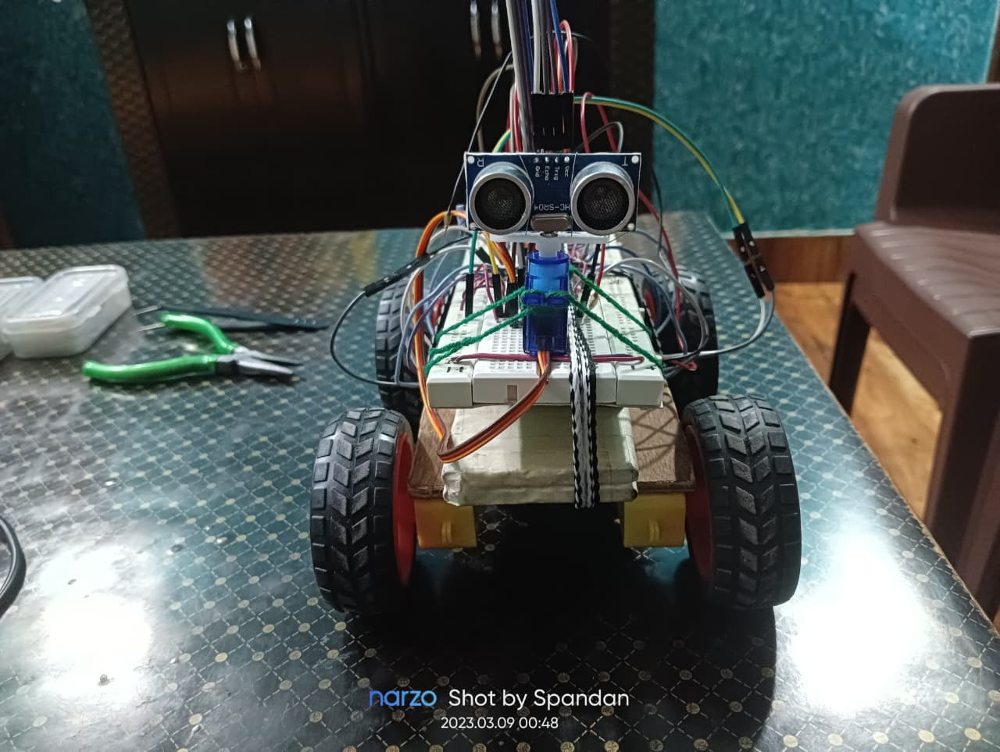
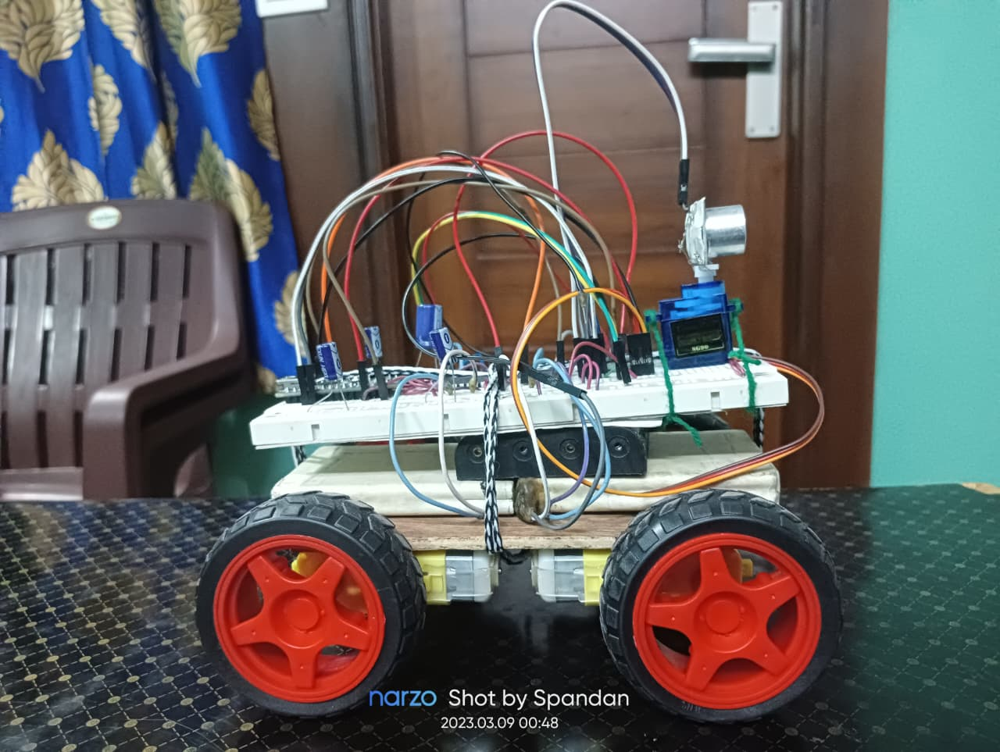
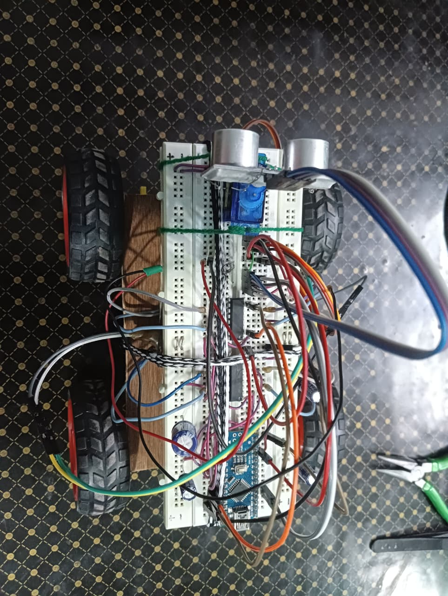
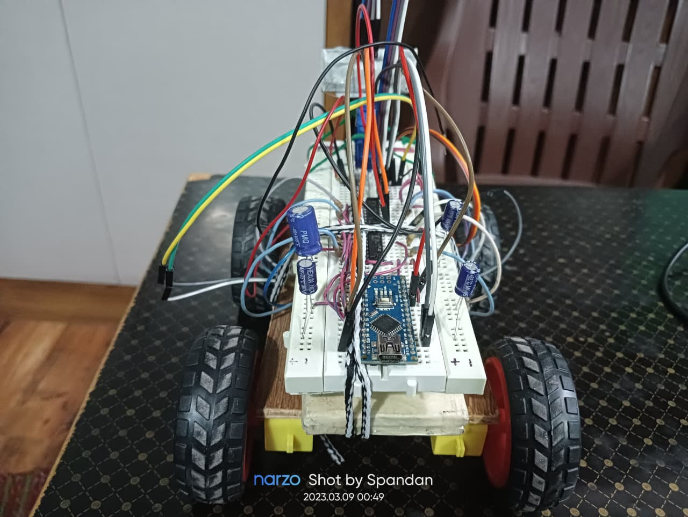

# 🚗 Obstacle Avoiding Car using Arduino Nano & Ultrasonic Sensor

An **autonomous obstacle avoiding robotic car** built using **Arduino Nano**, **L293D motor driver IC**, **HC-SR04 ultrasonic sensor**, and a **9g servo motor**.  
The robot continuously scans its surroundings, detects obstacles in front of it, and intelligently changes direction to avoid collisions.

This project demonstrates **sensor-based autonomous navigation**, **real-time decision making**, and **motor control using embedded systems**.

---

## 📌 Features

- 🤖 Fully autonomous obstacle avoidance
- 📡 Distance measurement using HC-SR04 ultrasonic sensor
- 🔄 Servo-based ultrasonic scanning (left & right)
- ⚙️ Dual L293D motor drivers for 4 DC motors
- 🧠 Arduino Nano based compact control system
- 🔋 External power supply for motors
- 🔧 Breadboard-friendly and easy to expand

---

## 🧰 Components Used

- Arduino Nano  
- L293D Motor Driver IC ×2  
- HC-SR04 Ultrasonic Sensor  
- 9g Servo Motor  
- DC Gear Motors ×4  
- 9V Battery ×2  
- Breadboard  
- Jumper Wires  

---

## 🔌 Circuit Diagram


**Key Connections:**
- HC-SR04 TRIG & ECHO → Arduino analog pins (defined in code)  
- Servo signal pin → Arduino PWM pin (defined in code)  
- L293D motor inputs → Arduino digital pins (defined in code)
- Motor supply → External 9V battery  
- Common GND shared between Arduino, sensors, and motor drivers  

---

## 💻 Arduino Code

- Written in **Embedded C**
- Uses **HC-SR04 ultrasonic sensor** for distance measurement
- Servo motor rotates the ultrasonic sensor for directional scanning

```cpp
// Motor Driver Pins
#define frontRight1 2
#define frontRight2 3
#define frontLeft1 4
#define frontLeft2 5

#define backRight1 6
#define backRight2 7
#define backLeft1 8
#define backLeft2 9

// Ultrasonic Sensor Pins
#define trigPin 10
#define echoPin 11

// Servo Motor Pin
#define servoPin 12
```

The complete source code is available here:  
📂 `code/Obstacle_avoiding_car.ino`

---

## 🚀 Working Principle

1. Ultrasonic sensor measures distance ahead  
2. If obstacle distance is below threshold:
   - Robot stops
   - Servo rotates sensor left and right
   - Distances are compared  
3. Robot turns towards the direction with maximum clearance  
4. Process repeats continuously for autonomous navigation  

---

## 🚀 How to Use

1. Upload the `Obstacle_avoiding_car.ino` file to Arduino Nano  
2. Assemble the circuit as shown in the diagram  
3. Power the motors and Arduino  
4. Place the robot on the ground  
5. The car will automatically start avoiding obstacles 🤖🚗  

---

## 📸 Project Images

  
  
  
  

---

## 🎥 Project Demo Video

🔗 **Click here to watch the Obstacle Avoiding Car demo:**  
[Google Drive – Project Demo Video](https://drive.google.com/file/d/1O48HRwB14kjW6w8r0fAAk2EvMX_XK28R/view?usp=sharing)

---

## 🧠 Learning Outcomes

- Ultrasonic distance measurement  
- Servo motor control using PWM  
- Autonomous robotic navigation logic  
- Motor driver interfacing  
- Real-time decision making in embedded systems  

---

## 🔮 Future Improvements

- PID based obstacle avoidance  
- Speed control using PWM  
- IR sensor fusion  
- Mapping and path planning  
- Custom PCB design  

---

## 📜 License

This project is licensed under the **MIT License** — feel free to use, modify, and distribute.

---

## 🙌 Author

**Spandan Choudhury**  
Embedded Systems | Robotics | IoT  
GitHub: `@BeamCruzer`
